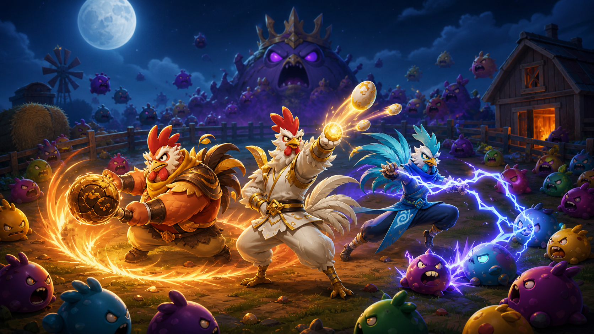
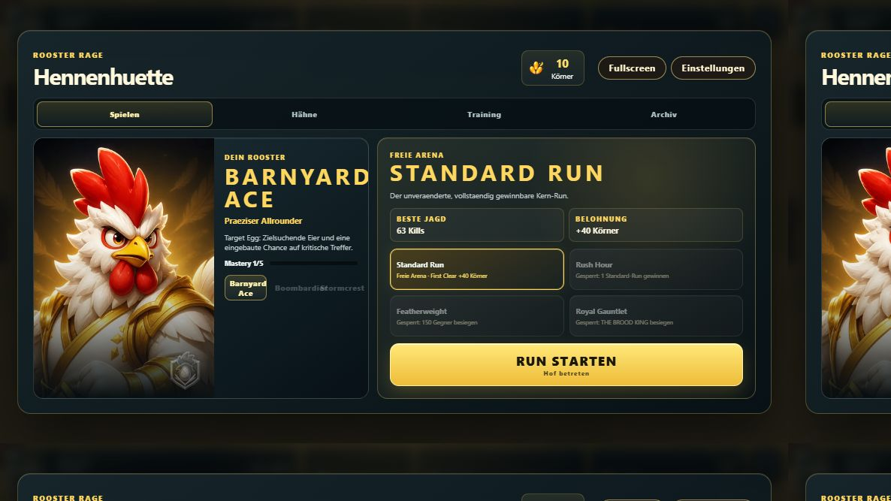
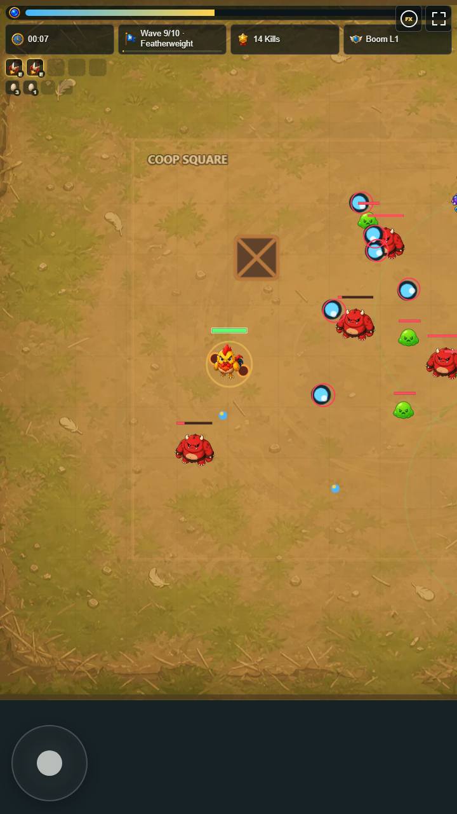

# Rooster Rage



**Drei Kampfhähne. Wilde Ei-Evolutionen. Ein Hof voller Monster.**

### [Rooster Rage jetzt im Browser spielen](https://emfau88.github.io/RoosterRage/)

Rooster Rage ist ein Mobile-first Bullet Heaven / Action Roguelite. Wähle Barnyard Ace, Boombardier oder Stormcrest, entwickle absurde Ei-Waffen und überlebe zehn eskalierende Wellen bis zum dreiphasigen Brood King.

> **Projektstatus:** Hauptmenü, Micro-Fodder, Horde-Dichte, XP-/Pickup-Pacing, Enemy-Animation-Polish und der UI-/Meta-Polish des aktuellen Production Pass sind umgesetzt und automatisiert abgenommen. Die GitHub-Pages-Version ist eine öffentliche Testfassung. Als Nächstes folgt das abschließende Multi-Seed-/Real-Run-Production-Gate.

## Aktueller Spielumfang

- Drei Rooster-Klassen mit eigenem Primärangriff, eigener Passive und je drei Build-Archetypen
- Klar gegliederte Hennenhütte mit `Spielen`, `Hähne`, dreistufigem Talentnest und vereinfachtem `Archiv`; der Run-Start bleibt auf Desktop und Mobile die Hauptaktion
- Zehn handkuratierte Wellen, drei Arenen, drei Elite-Archetypen und ein dreiphasiger Boss
- Echte 4-Richtungs-Locomotion für Kornkrabbler, Runner, Brute, Support,
  Summoner, Gilded Talon/Stormclaw und Brood King; Horde-Peaks bis 140 Gegner
  auf Desktop beziehungsweise 90 auf Mobile
- 45 Upgrades, elf sichtbare EVOs sowie Active-, Passive-, Orbit- und Summon-Builds; Karten zeigen neue Fähigkeiten, Rang-Deltas und EVO-Ziele getrennt
- Feste Wave-/Segment-XP-Budgets: Hordenmenge und Levelgeschwindigkeit sind getrennt steuerbar
- Sichtbare, magnetische XP-Orbs mit verlustfreier Bündelung: maximal 72 auf Desktop und 48 auf Mobile
- Heal-, Magnet- und Bomb-Pickups an strategischen Wave-Momenten statt an schnell steigenden Killzahlen
- Lokale Bestwerte, Challenges, Mastery, Talentnest, Kosmetik, Run-History, Gegnerlexikon und entdeckte EVO-Rezepte
- Mobile Portrait und Landscape als primäre Layouts, vollständige Desktop- und Fullscreen-Unterstützung
- Keine Werbung, Energie, Gacha- oder Pay-to-Win-Systeme

## Gameplay

<p align="center">
  
  
</p>

Der Charakter greift automatisch an. Bewegung, Positionierung, Upgrade-Auswahl und Build-Synergien entscheiden den Run. XP bleibt als sichtbares Orb-Sammelerlebnis in der Arena; erst bei großen Feldern werden nahe Orbs zu wertvolleren, größeren Orbs gebündelt.

- **Desktop:** WASD oder Pfeiltasten
- **Touch:** Auf der linken Bildschirmseite ziehen; der virtuelle Joystick folgt der Berührung
- **Interface:** Rooster-, Challenge- und Upgrade-Auswahl per Touch, Maus oder Pointer
- **Komfort:** Fullscreen sowie getrennte Einstellungen für Audio, Damage Numbers, Screen Shake, Flash und Vibration

## Lokal starten

Voraussetzungen: Node.js 24 und npm.

```bash
npm ci
npm run dev
```

Vite startet das Spiel standardmäßig unter `http://127.0.0.1:5173/`.

Produktions-Build:

```bash
npm run build
npm run test:production
```

## Qualitätssicherung

Die Browser-Tests verwenden Playwright und starten bei Bedarf selbstständig einen lokalen Vite-Server.

```bash
npm run test:smoke
npm run test:mechanics
npm run test:pacing
npm run test:arena
npm run test:foundation
npm run test:pressure
npm run test:product
npm run test:acceptance
```

Weitere spezialisierte Gates stehen unter anderem über `test:boss`, `test:evolution`, `test:meta`, `test:balance`, `test:soak` und `test:telegraphs` bereit. Die Horde-Lastprüfung erreicht bei 75, 110 und 150 aktiven Kornkrabblern jeweils 16,7 ms p95 ohne Enemy-Pool-Drops. Das Mobile-Pressure-Gate prüft Wave 7 mit allen drei Hähnen. Eigene Regressionen sichern XP-Werterhalt, Desktop-/Mobile-Orb-Caps und das neue Pickup-Pacing ab.

## Datenschutz

Die Produktmessung ist standardmäßig ausgeschaltet und muss sichtbar aktiviert werden. Ohne konfigurierten Telemetrie-Endpunkt werden keine Daten gesendet. Es gibt keine Konten, Cookies, Werbe-IDs oder persistente Sitzungs-ID; erfasst werden ausschließlich grobe Funnel- und Run-Ereignisse.

## Technik

- Phaser 3.90
- Vite 8
- Vanilla JavaScript und CSS
- Playwright für Browser-, Mobile-Viewport- und Acceptance-Tests
- GitHub Actions und GitHub Pages Release-Pipeline

## Dokumentation und Medien

- [Aktueller Production Pass](RoosterRage_Next_Production_Pass.md)
- [Produkt- und Entwicklungsroadmap](ROADMAP.md)
- [Vertical-Slice-Validierung](docs/PHASE_17_VALIDATION.md)
- [Kommerzielle Validierung](docs/PHASE_18_COMMERCIAL_VALIDATION.md)
- [Character Art und HUD Production Pass](docs/PHASE_19_VISUAL_PRODUCTION.md)
- [Store-Texte und Asset-Manifest](docs/marketing/STORE_COPY.md)
- [36-Sekunden-Gameplay-Reel](docs/marketing/trailer/rooster-rage-35s-gameplay-reel.webm)

Das gezeigte Key Art ist eine originale, textfreie Marketingillustration. Titel, Altersfreigabe und Store-CTA werden erst im jeweiligen Plattform-Export ergänzt.
