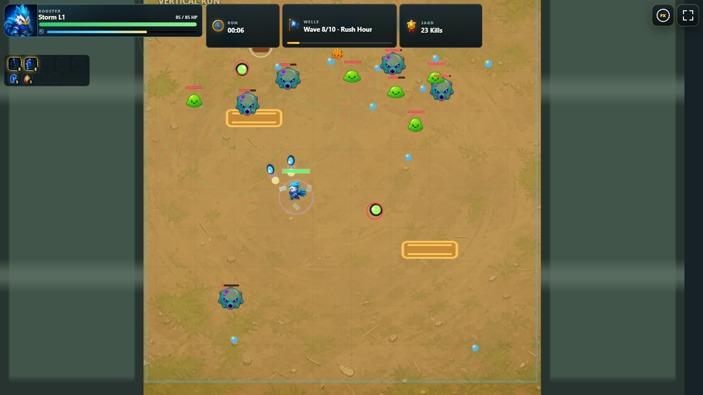

# Rooster Rage


**Drei Kampfhaehne. Wilde Ei-Evolutionen. Ein Hof voller Monster.**

### [Rooster Rage jetzt im Browser spielen](https://emfau88.github.io/RoosterRage/)

Rooster Rage ist ein Mobile-first Bullet Heaven / Action Roguelite. Waehle Barnyard Ace, Boombardier oder Stormcrest, entwickle absurde Ei-Waffen und ueberlebe zehn eskalierende Wellen bis zum dreiphasigen Brood King.

> **Projektstatus:** Der automatisierte Commercial Vertical Slice und der visuelle Character-/HUD-Production-Pass sind abgeschlossen. Die aktuelle GitHub-Pages-Version steht als oeffentliche Testfassung bereit; der manuelle End-to-End-Test sowie externe Spieltests stehen noch aus.

## Der Vertical Slice

- Drei Rooster-Klassen mit eigenem Primaerangriff, eigener Passive und je drei Build-Archetypen
- Drei individuelle 4x4-Richtungssheets und drei eigene Charakterportraets, visuell aus dem Key Art abgeleitet
- Zehn handkuratierte Wellen, drei Arenen, drei Elite-Archetypen und ein dreiphasiger Boss
- 25 belastbare Upgrades, elf sichtbare EVOs sowie Active-, Passive-, Orbit- und Summon-Builds
- Kurze Runs mit Zielkorridor von etwa sieben bis neun Minuten
- Hennenhuette mit lokalen Bestwerten, Challenges, Kosmetik und entdeckten EVO-Rezepten
- Mobile Portrait und Landscape als primaere Layouts, vollstaendige Desktop-Unterstuetzung
- Keine Werbung, Energie, Gacha- oder Pay-to-Win-Systeme im Slice

## Gameplay

<p align="center">
  
  
</p>

Der Charakter greift automatisch an. Bewegung, Positionierung, Upgrade-Auswahl und Build-Synergien entscheiden den Run.

- **Desktop:** WASD oder Pfeiltasten
- **Touch:** Auf der linken Bildschirmseite ziehen; der virtuelle Joystick folgt der Beruehrung
- **Interface:** Rooster-, Challenge- und Upgrade-Auswahl per Touch, Maus oder Pointer
- **Komfort:** Fullscreen sowie getrennte Einstellungen fuer Audio, Damage Numbers, Screen Shake, Flash und Vibration

## Lokal starten

Voraussetzungen: Node.js 24 und npm.

```bash
npm ci
npm run dev
```

Vite startet das Spiel standardmaessig unter `http://127.0.0.1:5173/`.

Produktions-Build:

```bash
npm run build
npm run test:production
```

## Qualitaetssicherung

Die Browser-Tests verwenden Playwright und starten bei Bedarf selbststaendig einen lokalen Vite-Server.

```bash
npm run test:smoke
npm run test:mechanics
npm run test:pacing
npm run test:boss
npm run test:evolution
npm run test:arena
npm run test:encounter
npm run test:hud-report
npm run test:rooster-depth
npm run test:meta
npm run test:product
npm run test:acceptance
```

Zusaetzliche Last-, Balance- und Telegraph-Pruefungen stehen ueber `test:soak`, `test:balance` und `test:telegraphs` bereit. Der letzte zehnminuetige Soak lief ueber 36.093 Frames mit einem p95 von 16,8 ms, ohne Pool-Drops oder verbleibende aktive Testobjekte.

## Datenschutz

Die Produktmessung ist standardmaessig ausgeschaltet und muss sichtbar aktiviert werden. Ohne konfigurierten Telemetrie-Endpunkt werden keine Daten gesendet. Es gibt keine Konten, Cookies, Werbe-IDs oder persistente Sitzungs-ID; erfasst werden ausschliesslich grobe Funnel- und Run-Ereignisse.

## Technik

- Phaser 3.90
- Vite 8
- Vanilla JavaScript und CSS
- Playwright fuer Browser-, Mobile-Viewport- und Acceptance-Tests
- GitHub Actions und GitHub Pages Release-Pipeline

## Dokumentation und Medien

- [Produkt- und Entwicklungsroadmap](ROADMAP.md)
- [Vertical-Slice-Validierung](docs/PHASE_17_VALIDATION.md)
- [Kommerzielle Validierung](docs/PHASE_18_COMMERCIAL_VALIDATION.md)
- [Character Art und HUD Production Pass](docs/PHASE_19_VISUAL_PRODUCTION.md)
- [Store-Texte und Asset-Manifest](docs/marketing/STORE_COPY.md)
- [36-Sekunden-Gameplay-Reel](docs/marketing/trailer/rooster-rage-35s-gameplay-reel.webm)

Das gezeigte Key Art ist eine originale, textfreie Marketingillustration. Titel, Altersfreigabe und Store-CTA werden erst im jeweiligen Plattform-Export ergaenzt.
