# Vorher / Nachher · Paket 1 und 2

16 direkte Bildpaare, erstellt am 1. Oktober 2026. Links vorher, rechts nachher. [Alle Vergleiche als Galerie](index.html). Bilder anklicken, um die unveränderten Originale zu öffnen.

## Spieler-HP und Bodenmarkierung · Querformat

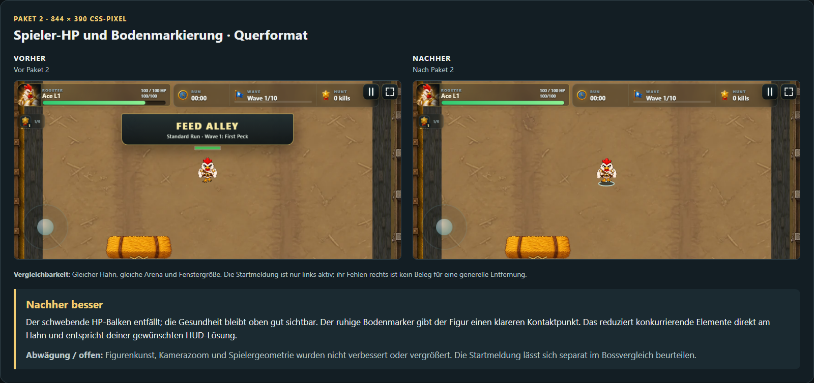

**Nachher besser.** Der schwebende HP-Balken entfällt; die Gesundheit bleibt oben gut sichtbar. Der ruhige Bodenmarker gibt der Figur einen klareren Kontaktpunkt. Das reduziert konkurrierende Elemente direkt am Hahn und entspricht deiner gewünschten HUD-Lösung.

**Abwägung / offen:** Figurenkunst, Kamerazoom und Spielergeometrie wurden nicht verbessert oder vergrößert. Die Startmeldung lässt sich separat im Bossvergleich beurteilen.

**Vergleichbarkeit:** Gleicher Hahn, gleiche Arena und Fenstergröße. Die Startmeldung ist nur links aktiv; ihr Fehlen rechts ist kein Beleg für eine generelle Entfernung.

[Original vorher](../portal-package-1/landscape-feed-alley-geometry.png) · [Original nachher](../portal-package-2/feed-844-ace.png)

## Spielerlesbarkeit · Handy-Hochformat

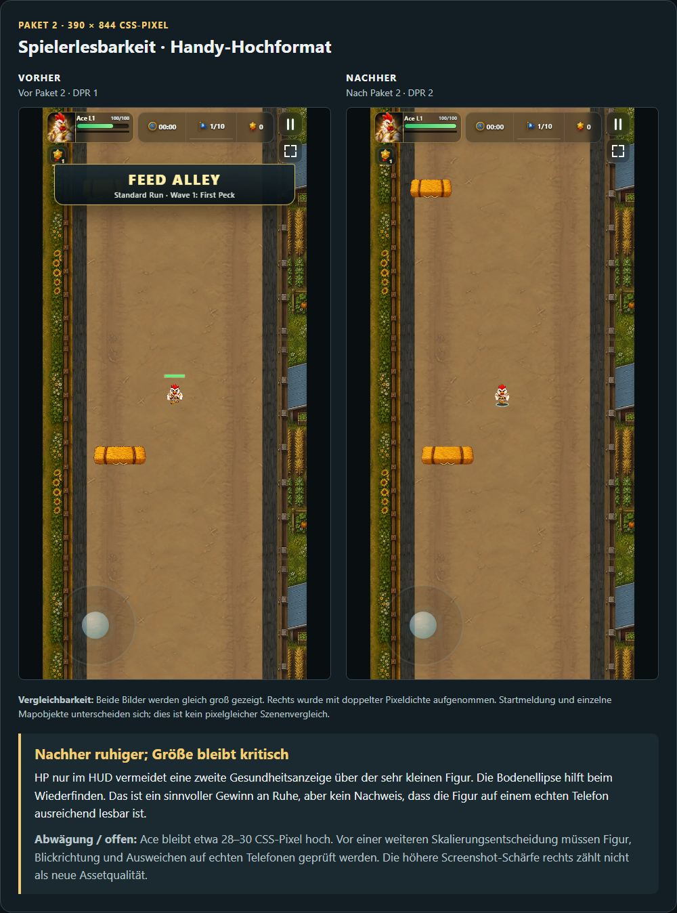

**Nachher ruhiger; Größe bleibt kritisch.** HP nur im HUD vermeidet eine zweite Gesundheitsanzeige über der sehr kleinen Figur. Die Bodenellipse hilft beim Wiederfinden. Das ist ein sinnvoller Gewinn an Ruhe, aber kein Nachweis, dass die Figur auf einem echten Telefon ausreichend lesbar ist.

**Abwägung / offen:** Ace bleibt etwa 28–30 CSS-Pixel hoch. Vor einer weiteren Skalierungsentscheidung müssen Figur, Blickrichtung und Ausweichen auf echten Telefonen geprüft werden. Die höhere Screenshot-Schärfe rechts zählt nicht als neue Assetqualität.

**Vergleichbarkeit:** Beide Bilder werden gleich groß gezeigt. Rechts wurde mit doppelter Pixeldichte aufgenommen. Startmeldung und einzelne Mapobjekte unterscheiden sich; dies ist kein pixelgleicher Szenenvergleich.

[Original vorher](../portal-package-1/portrait-feed-alley-geometry.png) · [Original nachher](../portal-package-2/feed-390-ace.png)

## Bossmeldung und volles Loadout

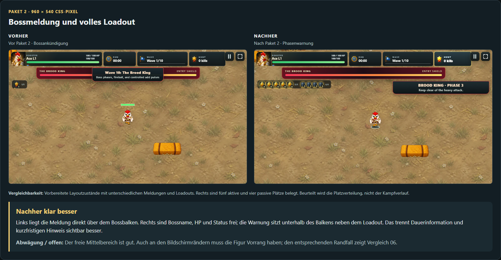

**Nachher klar besser.** Links liegt die Meldung direkt über dem Bossbalken. Rechts sind Bossname, HP und Status frei; die Warnung sitzt unterhalb des Balkens neben dem Loadout. Das trennt Dauerinformation und kurzfristigen Hinweis sichtbar besser.

**Abwägung / offen:** Der freie Mittelbereich ist gut. Auch an den Bildschirmrändern muss die Figur Vorrang haben; den entsprechenden Randfall zeigt Vergleich 06.

**Vergleichbarkeit:** Vorbereitete Layoutzustände mit unterschiedlichen Meldungen und Loadouts. Rechts sind fünf aktive und vier passive Plätze belegt. Beurteilt wird die Platzverteilung, nicht der Kampfverlauf.

[Original vorher](../portal-package-1/desktop-boss-banner-layout.png) · [Original nachher](../portal-package-2/boss-layout-960.png)

## Bosskampf · reguläre Welle 10

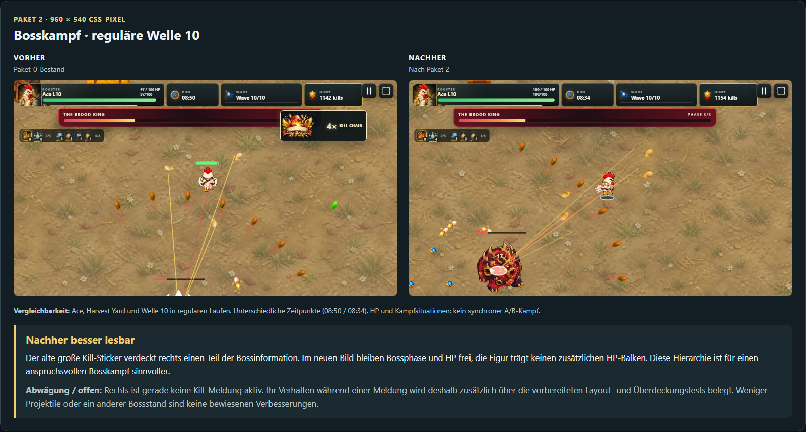

**Nachher besser lesbar.** Der alte große Kill-Sticker verdeckt rechts einen Teil der Bossinformation. Im neuen Bild bleiben Bossphase und HP frei, die Figur trägt keinen zusätzlichen HP-Balken. Diese Hierarchie ist für einen anspruchsvollen Bosskampf sinnvoller.

**Abwägung / offen:** Rechts ist gerade keine Kill-Meldung aktiv. Ihr Verhalten während einer Meldung wird deshalb zusätzlich über die vorbereiteten Layout- und Überdeckungstests belegt. Weniger Projektile oder ein anderer Bossstand sind keine bewiesenen Verbesserungen.

**Vergleichbarkeit:** Ace, Harvest Yard und Welle 10 in regulären Läufen. Unterschiedliche Zeitpunkte (08:50 / 08:34), HP und Kampfsituationen; kein synchroner A/B-Kampf.

[Original vorher](../portal-package-0/runs/ace-yard/wave-10-peak.png) · [Original nachher](../portal-package-2/runs/ace-yard/wave-10-peak.png)

## Gegner-HP · volle Kampfszene in Feed Alley

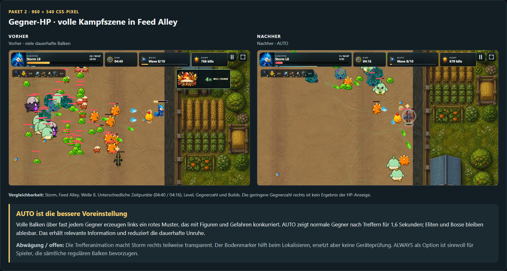

**AUTO ist die bessere Voreinstellung.** Volle Balken über fast jedem Gegner erzeugen links ein rotes Muster, das mit Figuren und Gefahren konkurriert. AUTO zeigt normale Gegner nach Treffern für 1,6 Sekunden; Eliten und Bosse bleiben ablesbar. Das erhält relevante Information und reduziert die dauerhafte Unruhe.

**Abwägung / offen:** Die Trefferanimation macht Storm rechts teilweise transparent. Der Bodenmarker hilft beim Lokalisieren, ersetzt aber keine Geräteprüfung. ALWAYS als Option ist sinnvoll für Spieler, die sämtliche regulären Balken bevorzugen.

**Vergleichbarkeit:** Storm, Feed Alley, Welle 8. Unterschiedliche Zeitpunkte (04:40 / 04:16), Level, Gegnerzahl und Builds. Die geringere Gegnerzahl rechts ist kein Ergebnis der HP-Anzeige.

[Original vorher](../portal-package-0/runs/storm-alley-late/wave-8-peak.png) · [Original nachher](../portal-package-2/runs/storm-alley-late/wave-8-peak.png)

## Meldung über der Figur · korrigierter Randfall

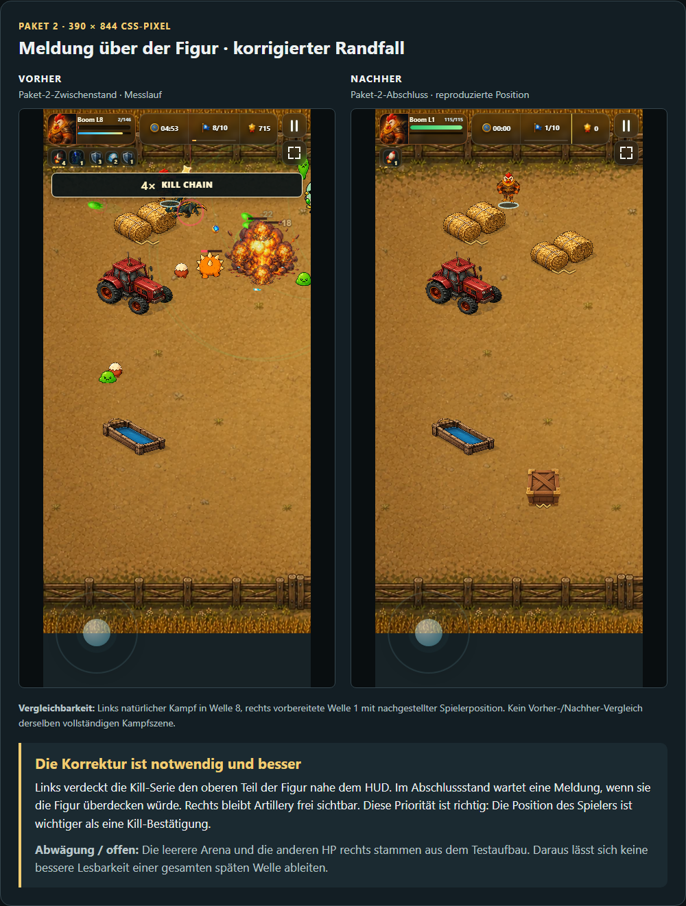

**Die Korrektur ist notwendig und besser.** Links verdeckt die Kill-Serie den oberen Teil der Figur nahe dem HUD. Im Abschlussstand wartet eine Meldung, wenn sie die Figur überdecken würde. Rechts bleibt Artillery frei sichtbar. Diese Priorität ist richtig: Die Position des Spielers ist wichtiger als eine Kill-Bestätigung.

**Abwägung / offen:** Die leerere Arena und die anderen HP rechts stammen aus dem Testaufbau. Daraus lässt sich keine bessere Lesbarkeit einer gesamten späten Welle ableiten.

**Vergleichbarkeit:** Links natürlicher Kampf in Welle 8, rechts vorbereitete Welle 1 mit nachgestellter Spielerposition. Kein Vorher-/Nachher-Vergleich derselben vollständigen Kampfszene.

[Original vorher](../portal-package-2/runs/artillery-coop-novice/wave-8-peak.png) · [Original nachher](../portal-package-2/coop-player-edge-clear.png)

## Settings · Gegner-HP als Wahlmöglichkeit

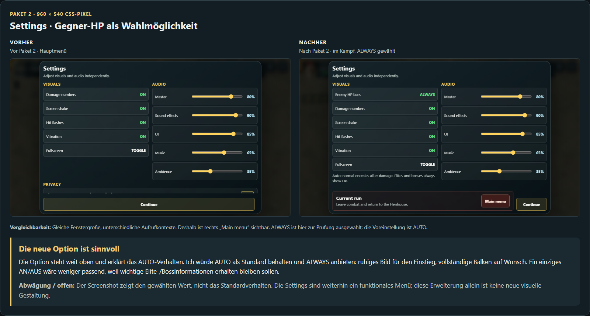

**Die neue Option ist sinnvoll.** Die Option steht weit oben und erklärt das AUTO-Verhalten. Ich würde AUTO als Standard behalten und ALWAYS anbieten: ruhiges Bild für den Einstieg, vollständige Balken auf Wunsch. Ein einziges AN/AUS wäre weniger passend, weil wichtige Elite-/Bossinformationen erhalten bleiben sollen.

**Abwägung / offen:** Der Screenshot zeigt den gewählten Wert, nicht das Standardverhalten. Die Settings sind weiterhin ein funktionales Menü; diese Erweiterung allein ist keine neue visuelle Gestaltung.

**Vergleichbarkeit:** Gleiche Fenstergröße, unterschiedliche Aufrufkontexte. Deshalb ist rechts „Main menu“ sichtbar. ALWAYS ist hier zur Prüfung ausgewählt; die Voreinstellung ist AUTO.

[Original vorher](../portal-package-1/desktop-first-settings.png) · [Original nachher](../portal-package-2/enemy-hp-settings.png)

## Startmenü · Desktop

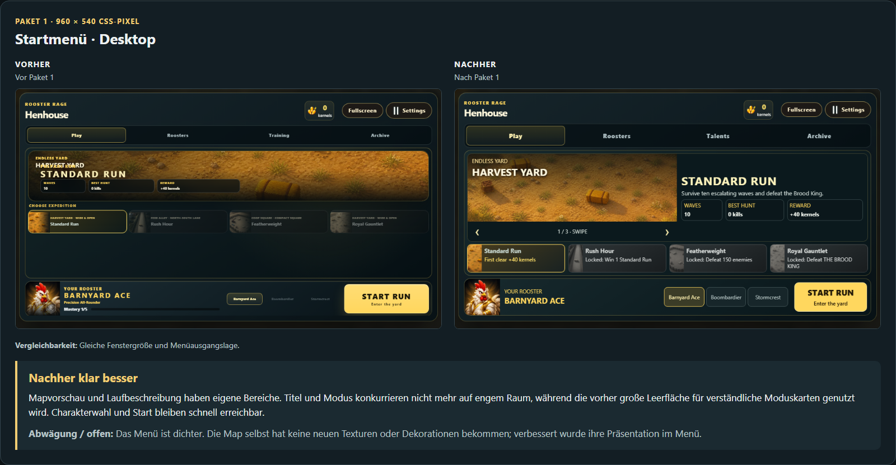

**Nachher klar besser.** Mapvorschau und Laufbeschreibung haben eigene Bereiche. Titel und Modus konkurrieren nicht mehr auf engem Raum, während die vorher große Leerfläche für verständliche Moduskarten genutzt wird. Charakterwahl und Start bleiben schnell erreichbar.

**Abwägung / offen:** Das Menü ist dichter. Die Map selbst hat keine neuen Texturen oder Dekorationen bekommen; verbessert wurde ihre Präsentation im Menü.

**Vergleichbarkeit:** Gleiche Fenstergröße und Menüausgangslage.

[Original vorher](../portal-package-0/desktop-first-play.png) · [Original nachher](../portal-package-1/desktop-first-play.png)

## Startmenü · Handy-Hochformat

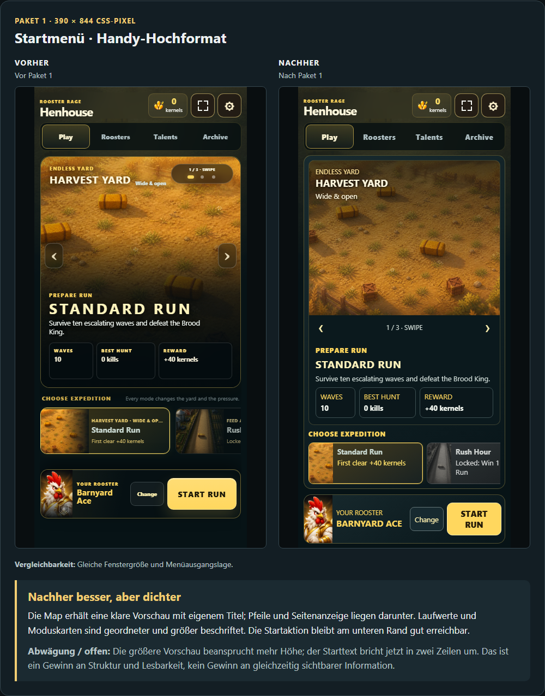

**Nachher besser, aber dichter.** Die Map erhält eine klare Vorschau mit eigenem Titel; Pfeile und Seitenanzeige liegen darunter. Laufwerte und Moduskarten sind geordneter und größer beschriftet. Die Startaktion bleibt am unteren Rand gut erreichbar.

**Abwägung / offen:** Die größere Vorschau beansprucht mehr Höhe; der Starttext bricht jetzt in zwei Zeilen um. Das ist ein Gewinn an Struktur und Lesbarkeit, kein Gewinn an gleichzeitig sichtbarer Information.

**Vergleichbarkeit:** Gleiche Fenstergröße und Menüausgangslage.

[Original vorher](../portal-package-0/portrait-first-play.png) · [Original nachher](../portal-package-1/portrait-first-play.png)

## Upgradeauswahl · Desktop mit EVO-Rezepten

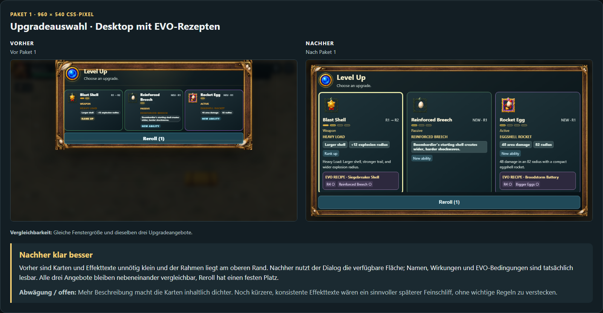

**Nachher klar besser.** Vorher sind Karten und Effekttexte unnötig klein und der Rahmen liegt am oberen Rand. Nachher nutzt der Dialog die verfügbare Fläche; Namen, Wirkungen und EVO-Bedingungen sind tatsächlich lesbar. Alle drei Angebote bleiben nebeneinander vergleichbar, Reroll hat einen festen Platz.

**Abwägung / offen:** Mehr Beschreibung macht die Karten inhaltlich dichter. Noch kürzere, konsistente Effekttexte wären ein sinnvoller späterer Feinschliff, ohne wichtige Regeln zu verstecken.

**Vergleichbarkeit:** Gleiche Fenstergröße und dieselben drei Upgradeangebote.

[Original vorher](../portal-package-0/desktop-primary-recipe-details.png) · [Original nachher](../portal-package-1/desktop-primary-recipe-details.png)

## Upgradeauswahl · kurzes Handy-Querformat

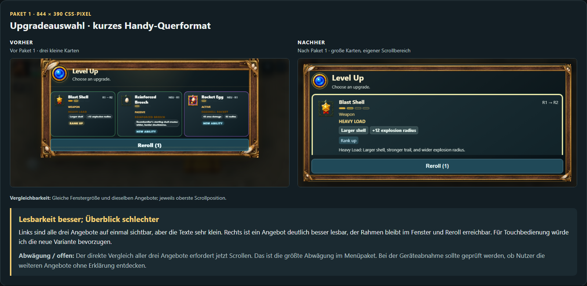

**Lesbarkeit besser; Überblick schlechter.** Links sind alle drei Angebote auf einmal sichtbar, aber die Texte sehr klein. Rechts ist ein Angebot deutlich besser lesbar, der Rahmen bleibt im Fenster und Reroll erreichbar. Für Touchbedienung würde ich die neue Variante bevorzugen.

**Abwägung / offen:** Der direkte Vergleich aller drei Angebote erfordert jetzt Scrollen. Das ist die größte Abwägung im Menüpaket. Bei der Geräteabnahme sollte geprüft werden, ob Nutzer die weiteren Angebote ohne Erklärung entdecken.

**Vergleichbarkeit:** Gleiche Fenstergröße und dieselben Angebote; jeweils oberste Scrollposition.

[Original vorher](../portal-package-0/landscape-primary-recipe-details.png) · [Original nachher](../portal-package-1/landscape-primary-recipe-details.png)

## Bossbelohnung · großes Fenster

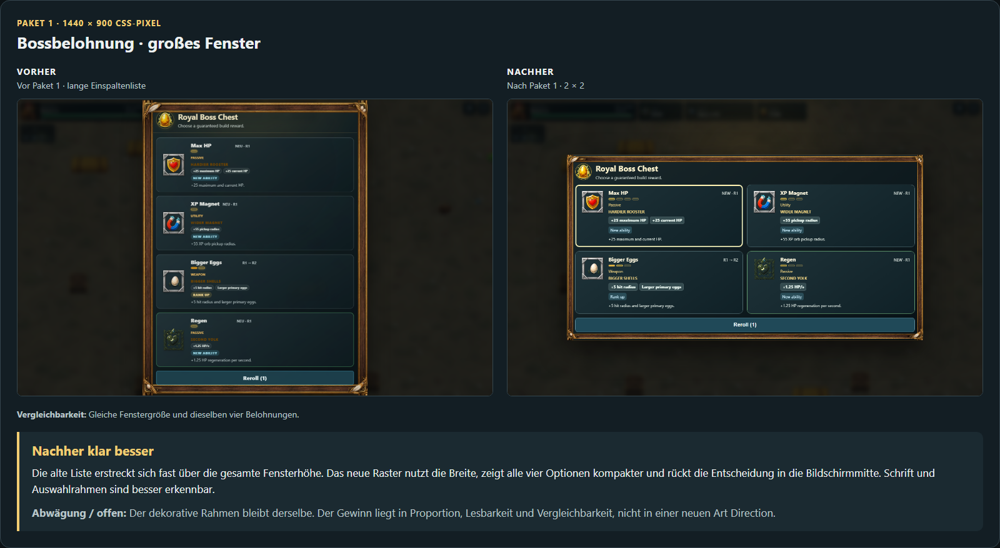

**Nachher klar besser.** Die alte Liste erstreckt sich fast über die gesamte Fensterhöhe. Das neue Raster nutzt die Breite, zeigt alle vier Optionen kompakter und rückt die Entscheidung in die Bildschirmmitte. Schrift und Auswahlrahmen sind besser erkennbar.

**Abwägung / offen:** Der dekorative Rahmen bleibt derselbe. Der Gewinn liegt in Proportion, Lesbarkeit und Vergleichbarkeit, nicht in einer neuen Art Direction.

**Vergleichbarkeit:** Gleiche Fenstergröße und dieselben vier Belohnungen.

[Original vorher](../portal-package-0/large-boss-chest.png) · [Original nachher](../portal-package-1/large-boss-chest.png)

## Bossbelohnung · kleiner Desktop

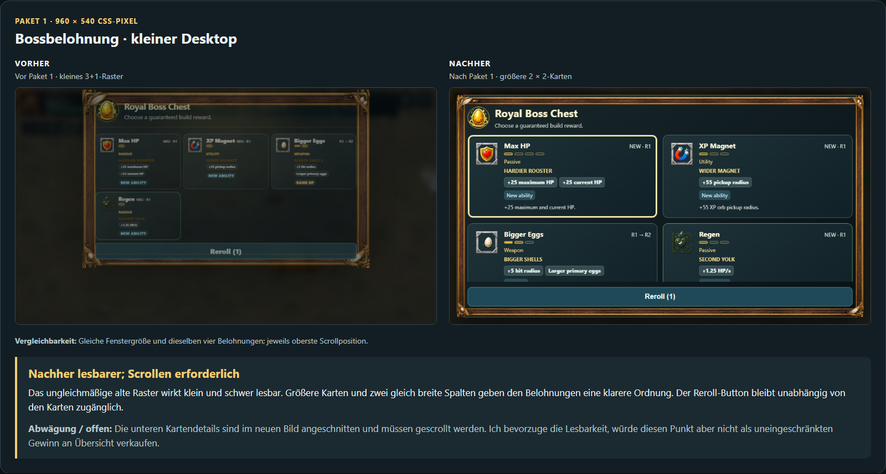

**Nachher lesbarer; Scrollen erforderlich.** Das ungleichmäßige alte Raster wirkt klein und schwer lesbar. Größere Karten und zwei gleich breite Spalten geben den Belohnungen eine klarere Ordnung. Der Reroll-Button bleibt unabhängig von den Karten zugänglich.

**Abwägung / offen:** Die unteren Kartendetails sind im neuen Bild angeschnitten und müssen gescrollt werden. Ich bevorzuge die Lesbarkeit, würde diesen Punkt aber nicht als uneingeschränkten Gewinn an Übersicht verkaufen.

**Vergleichbarkeit:** Gleiche Fenstergröße und dieselben vier Belohnungen; jeweils oberste Scrollposition.

[Original vorher](../portal-package-0/desktop-boss-chest.png) · [Original nachher](../portal-package-1/desktop-boss-chest.png)

## Charakterauswahl · Porträts und Namen

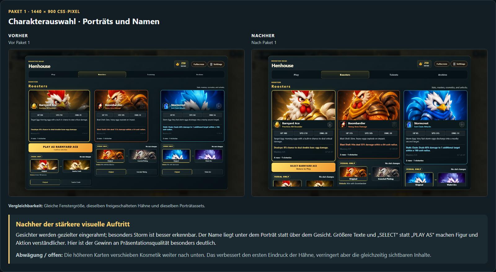

**Nachher der stärkere visuelle Auftritt.** Gesichter werden gezielter eingerahmt; besonders Storm ist besser erkennbar. Der Name liegt unter dem Porträt statt über dem Gesicht. Größere Texte und „SELECT“ statt „PLAY AS“ machen Figur und Aktion verständlicher. Hier ist der Gewinn an Präsentationsqualität besonders deutlich.

**Abwägung / offen:** Die höheren Karten verschieben Kosmetik weiter nach unten. Das verbessert den ersten Eindruck der Hähne, verringert aber die gleichzeitig sichtbaren Inhalte.

**Vergleichbarkeit:** Gleiche Fenstergröße, dieselben freigeschalteten Hähne und dieselben Porträtassets.

[Original vorher](../portal-package-0/large-advanced-roosters.png) · [Original nachher](../portal-package-1/large-advanced-roosters.png)

## Talentdetail · Handy-Hochformat

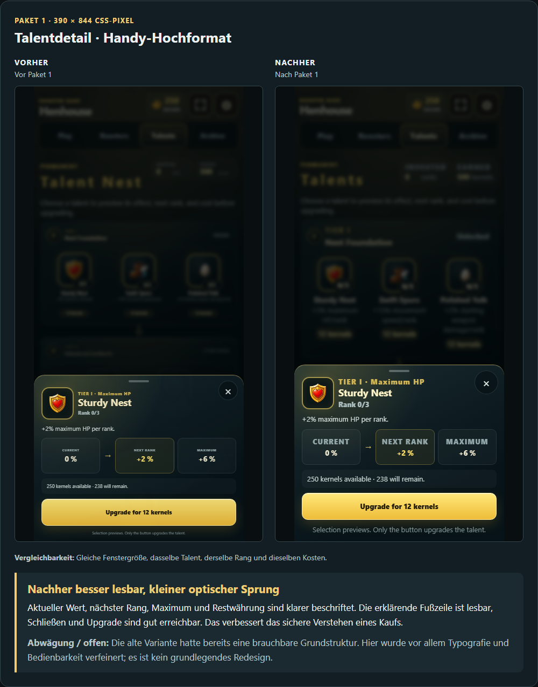

**Nachher besser lesbar, kleiner optischer Sprung.** Aktueller Wert, nächster Rang, Maximum und Restwährung sind klarer beschriftet. Die erklärende Fußzeile ist lesbar, Schließen und Upgrade sind gut erreichbar. Das verbessert das sichere Verstehen eines Kaufs.

**Abwägung / offen:** Die alte Variante hatte bereits eine brauchbare Grundstruktur. Hier wurde vor allem Typografie und Bedienbarkeit verfeinert; es ist kein grundlegendes Redesign.

**Vergleichbarkeit:** Gleiche Fenstergröße, dasselbe Talent, derselbe Rang und dieselben Kosten.

[Original vorher](../portal-package-0/portrait-advanced-talent-detail.png) · [Original nachher](../portal-package-1/portrait-advanced-talent-detail.png)

## Settings · kurzes Handy-Querformat

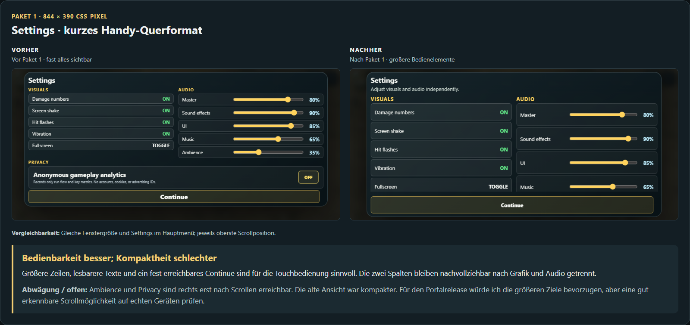

**Bedienbarkeit besser; Kompaktheit schlechter.** Größere Zeilen, lesbarere Texte und ein fest erreichbares Continue sind für die Touchbedienung sinnvoll. Die zwei Spalten bleiben nachvollziehbar nach Grafik und Audio getrennt.

**Abwägung / offen:** Ambience und Privacy sind rechts erst nach Scrollen erreichbar. Die alte Ansicht war kompakter. Für den Portalrelease würde ich die größeren Ziele bevorzugen, aber eine gut erkennbare Scrollmöglichkeit auf echten Geräten prüfen.

**Vergleichbarkeit:** Gleiche Fenstergröße und Settings im Hauptmenü; jeweils oberste Scrollposition.

[Original vorher](../portal-package-0/landscape-first-settings.png) · [Original nachher](../portal-package-1/landscape-first-settings.png)

## Umfang und Prüfung

Nur Vergleichsdokumentation; Spielcode, Assets und historische Aufnahmen unverändert. Keine neue Map- oder Charakterkunst in diesen Paketen. Die Figurenlesbarkeit auf echten Telefonen und die vollständige Geräte-/Portalabnahme bleiben offen.

Galerie und 16 PNG-Vergleichstafeln mit Chromium gerendert. 32 Originalbilder geladen, keine defekten Bilder oder Browserfehler. Auf Desktop und 390-Pixel-Hochformat kein horizontaler Überlauf; alle Bildpaare bleiben in gleich breiten Spalten nebeneinander. Bildseitenverhältnisse geprüft, SHA-256 der Quellen vor und nach dem Rendern identisch. [Quellenmanifest](sources.json) · [Prüfergebnis](verification.json).

Reproduktion aus dem Repository: `node docs/qa/portal-comparisons/render.mjs`.
