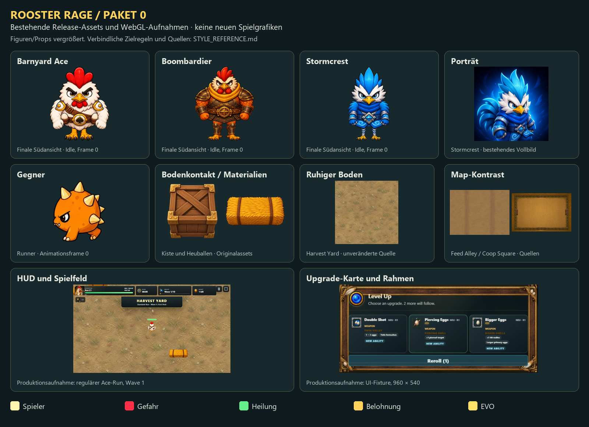

# Visuelle Leitplanken – Paket 0

Stand: 1. Oktober 2026. Referenz: unveränderter Release aus `fe75523`.

Die Tafel zeigt vorhandene Assets, keine Entwürfe für einen vollständigen Grafiktausch. Figuren und Props sind zur Materialprüfung vergrößert; die Spielaufnahmen sind verkleinert. Maßgeblich für Lesbarkeit sind die Originalscreenshots und die CSS-Messungen im Baseline-Bericht.

## Verbindliche Richtung für Pakete 1–4

| Bereich | Vorgabe | Grund und Abnahme |
| --- | --- | --- |
| Figuren | Die finalen vier Richtungen mit acht Idle-/Laufbildern erhalten. Ace: helle Federn, roter Kamm, Gold; Boombardier: Orange/Bronze, schwere Rüstung; Stormcrest: Weiß/Cyan/Blau. | Bereits eingeführte Klassenidentität erhalten. Neue Props müssen zu dieser Detail- und Materialqualität passen. Keine zusätzlichen Angriffsanimationen als Release-Voraussetzung. |
| Licht | Für neue oder überarbeitete Props weiches Hauptlicht von oben links; helle obere Kanten, zurückhaltende Schatten unten rechts. | Einfache gemeinsame Arbeitsregel. Bestehende Assets werden daran verglichen, nicht pauschal als fehlerhaft bewertet. Gerichtete Bodentexturen nicht zufällig spiegeln. |
| Konturen | Außenkontur klar, innere Details weicher. Die finalen Figuren bilden die Referenz für Konturgewicht in tatsächlicher Spielgröße. | Kiste, Heuballen und Runner nebeneinander auf derselben Map prüfen. Kein flächendeckendes Nachzeichnen; nur sichtbar zu schwere oder unscharfe Kanten anpassen. |
| Bodenkontakt | Kleine, weiche Kontaktverschattung unter Standfläche/Füßen; kein breiter dunkler Halo. Bestehende Treffer- und Vorwarnflächen freihalten. | Objekte sollen auf dem Boden stehen. Der Schatten darf weder eine gegnerische Gefahr noch eine vergrößerte Trefferfläche suggerieren. |
| Boden | Gedämpfte Erdtöne, niedriger Kontrast, wenige große Variationen. Wiederholung zuerst auf längeren Wegen beurteilen. | Figur, Projektile und Gefahren bleiben dominant. Kein neuer Apfelhain und keine Rückkehr zu dichter Dekoration. Streamingnähte auch nach Änderungen prüfen. |
| Mapidentität | Harvest Yard warm mit vorhandenen grünen Randakzenten; Feed Alley ruhige helle Spur und kühlere Gebäudeschatten; Coop Square trockener, eingefasster Hof. | Geometrie und vorhandene Randkulissen tragen die Identität. Eine Farbkorrektur darf Heilung oder Gefahren nicht verschleiern. Keine neuen Hindernisse im Art-Pass. |
| Leseflächen | Dunkle, ruhige Flächen aus dem bestehenden HUD/Menüstil; helle Schrift; warme Goldakzente für Auswahl und Belohnung. | Menüs und Upgrade-Karten sollen zusammengehören. Holz/Federn am Rand, nicht hinter Text. Vorhandenen Truhenrahmen bei Platzmangel verkleinern; Pflichtinformationen erhalten. |
| Typografie | Kartentitel mindestens 16 CSS-px; entscheidende Texte mindestens 12 auf Desktop und 13 in mobilen Layouts. Wichtige Touchaktionen mindestens 44×44 CSS-px. | Interne Qualitätsziele. Bei geringer Höhe scrollen oder Informationen staffeln. Effekte, Synergien und vorhandene EVO-Rezepte nicht per Höhenregel ausblenden. |
| Porträts | Individueller Fokuspunkt je Klasse. Augen und Gesicht sichtbar, auch im flachen Desktop-Kartenkopf. | Das Vollbild von Stormcrest enthält ein gut lesbares Gesicht; der aktuelle Zuschnitt verdeckt es bei 1440×900. Neues Porträt nicht erforderlich. |
| Icons | Eine stabile Zuordnung je Fähigkeit für Angebot, HUD und Ergebnis. Sachlich gleiche Funktionen dürfen dasselbe Symbol verwenden. | Zuerst fehlende Primärwaffen-Rangicons; danach verwechselbare Aliaspaare. Klassenfarbe allein ersetzt keine erkennbare Form. |
| Meldungen | Bossinformationen und ernste Warnungen haben Vorrang. Belohnungen/Chains nutzen kollisionsfreie Flächen oder warten. | Im regulären Ace-Run verdeckt die Kill-Chain den Bossbereich. Mehr Effekte ohne Raumplanung verschärfen den Befund. |

## Funktionsfarben erhalten

Die Farben kommen aus `src/data/presentationStandards.js`; hier wird kein neues Farbsystem erfunden.

| Funktion | Primär | Ergänzung |
| --- | --- | --- |
| Spieler / sichere Interaktion | `#fff3b0` | `#5ad7ff` |
| Gegner / Standardgeschosse | `#ff5268` | `#c18aff` |
| Dominante Gefahr / schwere Vorwarnung | `#ff3048` | `#ff9a3d` |
| Heilung / Nutzen | `#65ef8b` | `#5ad7ff` |
| Belohnung | `#ffd35c` | – |
| EVO | `#ffe16a` | `#ffffff` |

Warme Bodenflächen brauchen ausreichend Helligkeits- und Formkontrast zu gelben eigenen Geschossen. Cyan bleibt auch Klassenfarbe von Stormcrest: feindliche und sichere Flächen zusätzlich durch Randform/Bewegung unterscheiden. Nur beobachtete Verwechslungen ändern.

## Abnahme eines Art-Musters

1. Eine Kiste, einen Heuballen und eine Bodenfläche neben Ace, Boombardier und Stormcrest im Produktionsrenderer vergleichen.
2. Bei 960×540 und 390×844 Originalgröße sowie bei langen Wegen prüfen. Eine vergrößerte Referenztafel reicht nicht für die Freigabe.
3. Kontur, Licht, Bodenkontakt, Klassenidentität und Gefahrenerkennung gemeinsam prüfen. Kollisionsgeometrie nicht verändern.
4. Vorher/Nachher mit identischem Viewport, DPR, Arena, Klasse und vorbereitetem Zustand aufnehmen. Reguläre Runs mit gleichem Seed und Steuerprofil ergänzen; diese sind nicht bildgenau deterministisch.
5. Neue Dateien optimieren und die Releasegröße erneut messen. Die Ausgangslage lässt nur 576.476 Bytes unter dem internen 19-MiB-Budget frei.

## Quellen der Tafel

- Figuren: `src/assets/characters/{ace,artillery,storm}-final/rooster-*-final-idle.webp`, erste 256×256-Kachel.
- Porträt: `src/assets/characters/rooster-storm-portrait.webp`.
- Gegner: `src/assets/enemies/animations/enemy-runner-run.webp`, erste 256×256-Kachel.
- Props: `src/assets/map/arena-crate.webp`, `arena-bale.webp`.
- Boden: `src/assets/map/arena-ground-farm.webp`, `arena-ground-road.webp`, `coop-square-ground.webp`.
- HUD: `runs/ace-yard/wave-01.png`, regulärer Run.
- Upgrade-Karten: `desktop-queued-level-up.png`, ausdrücklich vorbereitetes UI-Szenario.

Die bestehende Figurenabnahme liegt unter `docs/qa/rooster-final-v1/`. Das bestehende Map-Lesbarkeitskonzept steht in `docs/MAP_REWORK.md` und `RoosterRage_Next_Production_Pass.md`.
