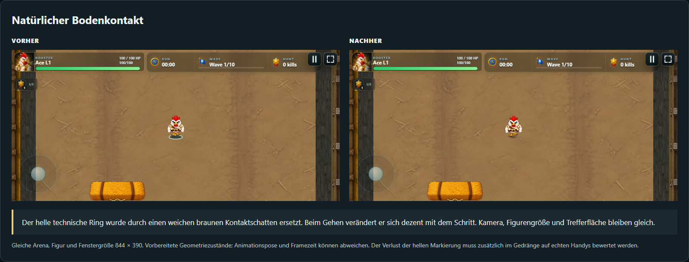
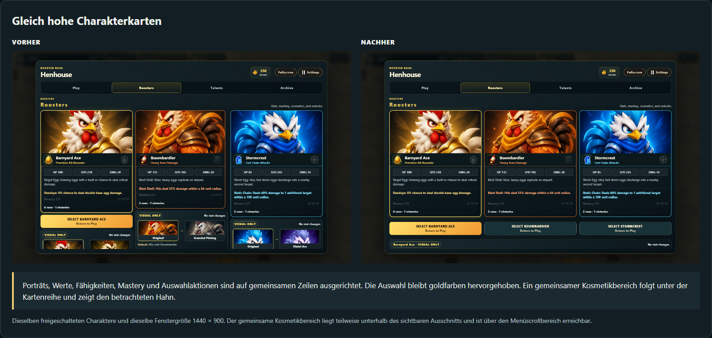
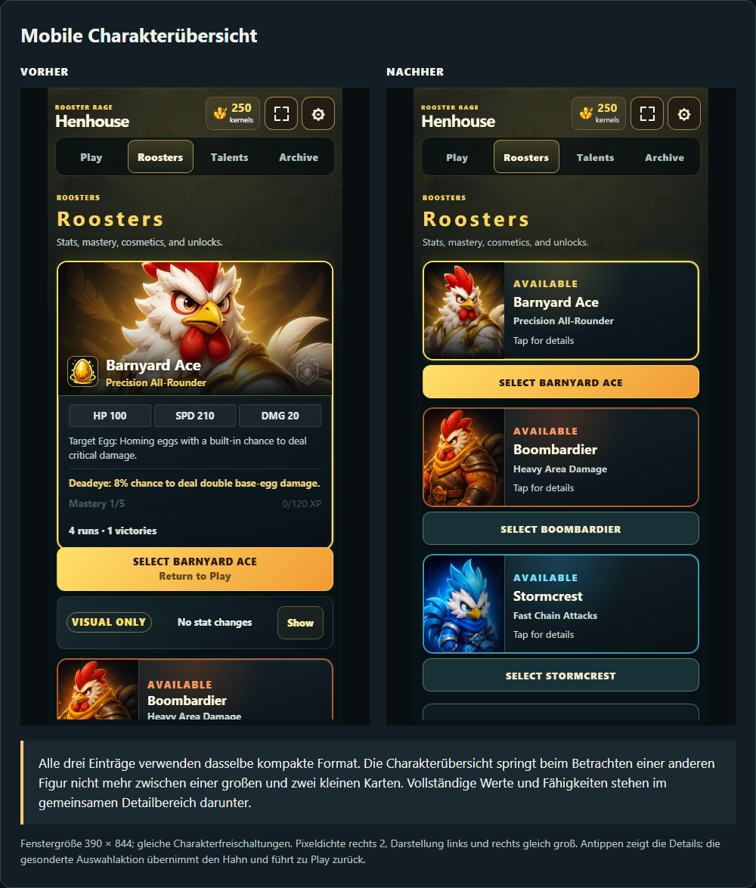
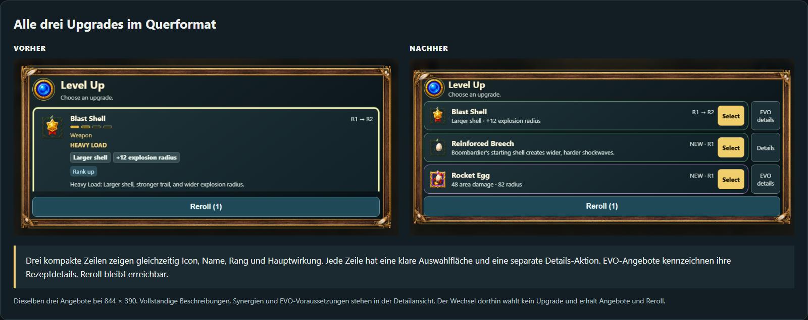
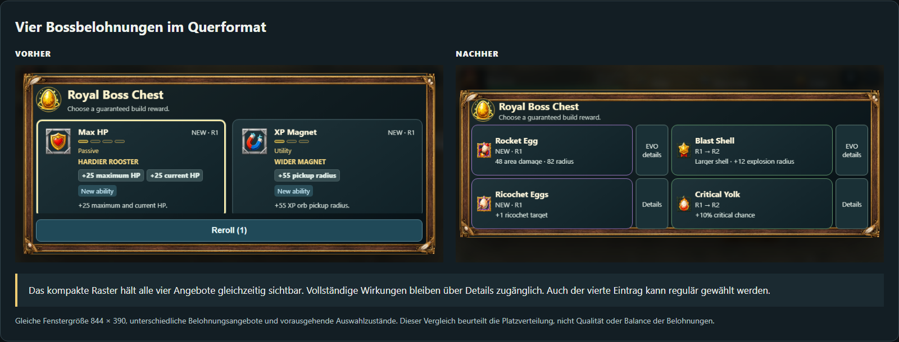

# Drei Nacharbeiten nach Paket 2

[Direkte Vorher-/Nachher-Galerie](index.html). Kamera, Figurengröße, Trefferflächen und Ausrichtungsunterstützung wurden nicht verändert.

## Natürlicher Bodenkontakt

Der helle technische Ring wurde durch einen weichen braunen Kontaktschatten ersetzt. Beim Gehen verändert er sich dezent mit dem Schritt. Kamera, Figurengröße und Trefferfläche bleiben gleich.

**Vergleichbarkeit und Grenze:** Gleiche Arena, Figur und Fenstergröße 844 × 390. Vorbereitete Geometriezustände; Animationspose und Framezeit können abweichen. Der Verlust der hellen Markierung muss zusätzlich im Gedränge auf echten Handys bewertet werden.

## Gleich hohe Charakterkarten

Porträts, Werte, Fähigkeiten, Mastery und Auswahlaktionen sind auf gemeinsamen Zeilen ausgerichtet. Die Auswahl bleibt goldfarben hervorgehoben. Ein gemeinsamer Kosmetikbereich folgt unter der Kartenreihe und zeigt den betrachteten Hahn.

**Vergleichbarkeit und Grenze:** Dieselben freigeschalteten Charaktere und dieselbe Fenstergröße 1440 × 900. Der gemeinsame Kosmetikbereich liegt teilweise unterhalb des sichtbaren Ausschnitts und ist über den Menüscrollbereich erreichbar.

## Mobile Charakterübersicht

Alle drei Einträge verwenden dasselbe kompakte Format. Die Charakterübersicht springt beim Betrachten einer anderen Figur nicht mehr zwischen einer großen und zwei kleinen Karten. Vollständige Werte und Fähigkeiten stehen im gemeinsamen Detailbereich darunter.

**Vergleichbarkeit und Grenze:** Fenstergröße 390 × 844; gleiche Charakterfreischaltungen. Pixeldichte rechts 2, Darstellung links und rechts gleich groß. Antippen zeigt die Details; die gesonderte Auswahlaktion übernimmt den Hahn und führt zu Play zurück.

## Alle drei Upgrades im Querformat

Drei kompakte Zeilen zeigen gleichzeitig Icon, Name, Rang und Hauptwirkung. Jede Zeile hat eine klare Auswahlfläche und eine separate Details-Aktion. EVO-Angebote kennzeichnen ihre Rezeptdetails. Reroll bleibt erreichbar.

**Vergleichbarkeit und Grenze:** Dieselben drei Angebote bei 844 × 390. Vollständige Beschreibungen, Synergien und EVO-Voraussetzungen stehen in der Detailansicht. Der Wechsel dorthin wählt kein Upgrade und erhält Angebote und Reroll.

## Vier Bossbelohnungen im Querformat

Das kompakte Raster hält alle vier Angebote gleichzeitig sichtbar. Vollständige Wirkungen bleiben über Details zugänglich. Auch der vierte Eintrag kann regulär gewählt werden.

**Vergleichbarkeit und Grenze:** Gleiche Fenstergröße 844 × 390, unterschiedliche Belohnungsangebote und vorausgehende Auswahlzustände. Dieser Vergleich beurteilt die Platzverteilung, nicht Qualität oder Balance der Belohnungen.

## Umsetzung

- Weicher, brauner Kontaktschatten mit transparentem Rand, ohne Konturlinie. Kleine Größenänderung an den Gehanimationsframes; im Stand ruhig. Einmalig erzeugte 128 × 64 Canvastextur, keine neue herunterzuladende Bilddatei.
- Desktopkarten verwenden gemeinsame Inhaltszeilen, gleiche Höhe und ausgerichtete Auswahlaktionen. Mobile Einträge sind gleich groß; vollständige Werte/Fähigkeiten im gemeinsamen Detailbereich. Kosmetik gehört zum aktuell betrachteten Hahn und steht gemeinsam unterhalb der Übersicht. Gesperrte Vorschauen bleiben möglich; Auswahl und gesperrte Kosmetik bleiben deaktiviert.
- Niedriges Querformat ab 600 Pixel Breite und bis 500 Pixel Höhe: drei kompakte Zeilen bzw. vier Bossangebote als 2×2-Raster. Hauptwirkung sofort sichtbar; vollständige Wirkungen, Synergien und Rezepte in Details. Öffnen/Schließen erhält Auswahl und Pause; Tastaturfokus bleibt im Detaildialog und kehrt zum Auslöser zurück. Auswahl aus Details übernimmt exakt ein Upgrade.

## Prüfung

- Responsive Menüprüfung: 20 Fenstergrößen und vier Interaktionsszenarien (Tastatur, Touch, Reroll, mehrere Belohnungen, vollständiger Build und EVO). [Menübericht](menus.json).
- Produktionsbuild: sieben Größen (1440×900, 960×540, 844×390, 736×360, 640×360, 390×844, 320×568), 35 Screenshots. Alle drei bzw. vier Angebote in den geprüften kurzen Querformaten ohne Scrollen erreichbar. Alle Kartenhöhen und Desktop-Inhaltszeilen ausgerichtet. Separate gesperrte Handyvorschau. [Nachweis](checks.json).
- Sechs Feed-Alley-Geometriefälle: drei Hähne auf zwei Fenstergrößen, Kamera/Skalierung/Radius gegen Paket 2 verglichen und identisch. Schattenfarbe und Transparenzrand gemessen. HP ausschließlich im HUD.
- Meta-, EVO-, Pause- und Release-Prüfung bestanden. Aktueller Release: 143 Dateien, 18,45 MiB; Produktions-iframe mit normalem und blockiertem Speicher.
- Die erste vollständige Menüprüfung wurde während laufender Bearbeitung durch ein Neuladen unterbrochen. Der abschließende Durchlauf ohne weitere Spielcodeänderungen und die unabhängigen Produktionsprüfungen sind bestanden.

**Offen:** menschliche Bedienung und Erkennbarkeit im späten Kampf auf echten Android-/iOS-Geräten, insbesondere Schatten ohne helle Kontur. Keine Behauptung vollständiger Portalabnahme. Punkt 4 und eine Hochformatpflicht sind nur besprochen, nicht umgesetzt.

Reproduktion: Release bauen, dann node scripts/capture-portal-refinements.mjs und node docs/qa/portal-refinements/render-gallery.mjs. Historische Paketbilder bleiben erhalten.
